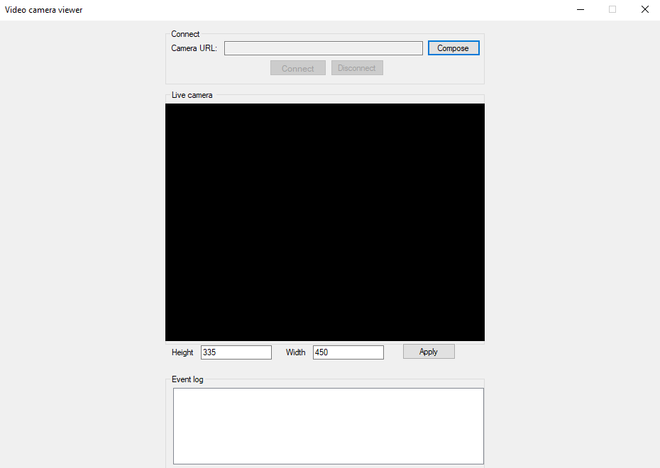

# Camera Security System

This project is a <b>standalone windows application</b> with pretty <b>GUI</b> of a <b>“Camera Security System”</b>. 

<h4>The purpose of this project is to provide following functionalities :</h4>

* It can record audio and video streams from multiple cameras simultaneously and can store the
recordings in mp4 format on your hard drives.  

* This gives you easy access and management of your recordings. This system operates even if there is no Internet connection and it allows you to add and remove
cameras in a very convenient way. 

* User can see live streaming of his/her own Webcam (In-Built available in your system). 

* User can also see live streaming of his/her own USB Camera.  

* If someone is having Live Security System using IP Cameras, then one can easily handle each and every detail with streaming.  
Can see recorded streaming, live streaming , Machine Learning techniques on recorded stream like Motion detection, Human body detection, and many more… 

<h3>Demo Screenshots</h3>

